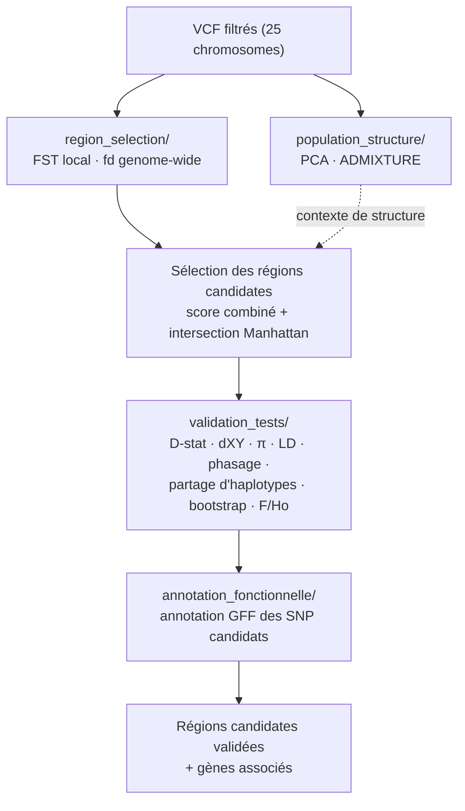

  

<h1 align="center">Awassi Introgression Genomics</h1>

  
  
  

Scripts d'analyse accompagnant le rapport de stage *« Introgression génomique chez le
mouton Awassi — signaux locaux d'introgression et validation multi-critères »* (Tanguy Ruel,
[LECA](https://leca.osug.fr/)). Recherche de régions du génome où la race Awassi (Moyen-Orient) présente une
affinité locale anormale avec un autre groupe géographique (Afrique, Asie, Europe, Amérique,
Océanie), signal compatible avec une introgression ancienne.

*Logo LECA (Laboratoire d'Écologie Alpine, UMR CNRS/UGA/USMB 5553) reproduit à titre
d'affiliation ; propriété de l'institution, non couvert par la licence MIT de ce dépôt.*

## En bref, la génétique pour les nuls

Un mouton hérite de son ADN de ses ancêtres. Quand deux populations longtemps séparées se
recroisent, des fragments d'ADN de l'une peuvent rester durablement présents chez l'autre :
c'est l'**introgression**. Ce stage cherche des traces de ce phénomène chez le mouton
Awassi (Moyen-Orient) : à certains endroits précis du génome, ressemble-t-il un peu plus que
prévu par hasard à des moutons d'Europe, d'Afrique, d'Asie ou d'Amérique ? Si oui, c'est le
signe qu'un échange génétique ancien a eu lieu à cet endroit précis.

Les scripts de ce dépôt : (1) décrivent la structure génétique globale des populations
étudiées, (2) balayent le génome pour repérer des zones suspectes, (3) vérifient par
plusieurs méthodes indépendantes que chaque zone candidate est un vrai signal et pas du
bruit statistique, puis (4) regardent quels gènes se trouvent dans ces zones.

## Glossaire express

| Terme | Sens simple |
|---|---|
| SNP | Une position du génome où l'ADN diffère d'un individu à l'autre (une « lettre » variable). |
| VCF | Format de fichier qui liste les SNP observés chez tous les individus séquencés. |
| FST | Différenciation génétique entre deux groupes à un endroit du génome (0 = identiques, 1 = totalement différents). |
| fd / D-stat | Mesurent si un groupe partage anormalement plus d'ADN avec un autre groupe que prévu — signal d'introgression. |
| dXY | Divergence génétique brute entre deux groupes, indépendante de leur diversité interne. |
| π (pi) | Diversité génétique à l'intérieur d'un groupe. |
| LD (déséquilibre de liaison) | Tendance de deux positions du génome à être héritées ensemble ; un LD élevé et localisé peut trahir un bloc d'ADN introgressé récent. |
| PCA / ADMIXTURE | Méthodes qui résument la structure génétique globale d'un jeu d'individus (combien de groupes ancestraux, qui ressemble à qui). |
| Phasage | Reconstitution de quel allèle vient de quel chromosome parental, pour reconstruire des haplotypes. |
| Haplotype | Combinaison de variants portée ensemble sur un même chromosome. |
| Bootstrap / jackknife | Méthodes de ré-échantillonnage statistique pour estimer la fiabilité d'un résultat. |

## Déroulé du pipeline

## Contenu de ce dépôt

20 scripts : un par méthode utilisée dans le rapport, organisés selon les mêmes sections
que le rapport (structure de population, sélection des régions candidates, tests de
validation, annotation fonctionnelle). Le dépôt de travail complet (~340 scripts,
itérations de mise au point incluses) reste local ; seule la version de référence de
chaque méthode est publiée ici, sous un nom explicite.

Chaque script commence par un commentaire d'en-tête (rôle, entrée, sortie, usage) et
comporte des commentaires dans le corps du code pour suivre chaque étape du calcul.

**Note** : les noms de fichiers ont été simplifiés par rapport au rapport de stage (qui cite
les noms internes du dépôt de travail dans son Annexe A). La table ci-dessous fait la
correspondance.

### `population_structure/`

| Méthode | Script | Nom dans le rapport (Annexe A) |
|---|---|---|
| ACP (PLINK --pca 20) | `pca.sh` | `01_pca/01_run_pca_25chr_filtered.sh` |
| ADMIXTURE | `admixture.sh` | `admixture/03_run_admixture_K2_K8_v1.sh` |

### `region_selection/`

| Méthode | Script | Nom dans le rapport (Annexe A) |
|---|---|---|
| FST local 20 kb / pas 5 kb | `fst_local_genomewide.sh` | `fst/21_run_FST_local_20kb_step5kb_separate_EU_AM_AUS.sh` |
| FST par SNP | `fst_per_snp_fd_ld_plot.py` | `synthese/13b_plot_fst_fd_ld_aligned_v9_perSNPfst.py` |
| fd | `fd_genomewide.py` | `fd/02_fd_chr_all_awassi_pairs_20kb_step5kb.py` |
| Sélection — score combiné | `select_regions_score_combine.py` | `synthese/15_rebuild_v10b.py` |
| Sélection — intersection (Manhattan) | `select_regions_intersection_manhattan.py` | `synthese/23_manhattan_fst_fd_genomewide.py` |

### `validation_tests/`

| Méthode | Script | Nom dans le rapport (Annexe A) |
|---|---|---|
| D-stat 150 kb + jackknife | `dstat_blockjackknife.py` | `synthese/27_dstat_9regions_blockjackknife_v1.py` |
| dXY | `dxy.py` | `dxy/02_compute_dxy_local_candidates.py` |
| π avec contrôle qualité | `pi_regions_qc.py` | `synthese/30_pi_9regions_20kb_step5kb_QC_v1.py` |
| π — fond génomique | `pi_genomewide_baseline.py` | `synthese/50_pi_genomewide_baseline_v1.py` |
| Phasage (Beagle) | `phasing_beagle.sh` | `synthese/10_phase_5regions_beagle_v1.sh` |
| LD par sous-groupe | `ld_par_sousgroupe.py` | `synthese/35_ld_per_subgroup_9regions_v1.py` |
| Heatmap + arbre + LD | `heatmap_haplotypes_arbre_ld.py` | `synthese/26_heatmap_LD_arbre_9regions_v2.py` |
| Raréfaction (partage d'haplotypes) | `rarefaction_partage_haplotypes.py` | `synthese/34_rarefaction_haplotype_sharing_9regions_v1.py` |
| Partage d'haplotypes, tous groupes (dépendance) | `partage_haplotypes_tous_groupes.py` | `synthese/64_haplotype_sharing_all_groups_v1.py` |
| Bootstrap de spécificité | `bootstrap_specificite_haplotypique.py` | `synthese/65_haplotype_specificity_bootstrap_v1.py` |
| F et Ho | `heterozygotie_consanguinite.py` | `synthese/56_het_inbreeding_v1.py` |
| CCDC91 — reprise sur le cœur du pic | `ccdc91_retest_pic.py` | `synthese/69_ccdc91_peak_core_retest_v1.py` |

### `annotation_fonctionnelle/`

| Méthode | Script | Nom dans le rapport (Annexe A) |
|---|---|---|
| Annotation fonctionnelle (GFF Oar_v4.0) | `annotation_variants_gff.py` | `synthese/40_annotate_variants_9regions_v1.py` |

## Logiciels externes utilisés (non fournis dans ce dépôt)

- [PLINK](https://www.cog-genomics.org/plink/) / [PLINK2](https://www.cog-genomics.org/plink/2.0/)
- [bcftools / vcftools](https://samtools.github.io/bcftools/)
- [ADMIXTURE](https://dalexander.github.io/admixture/) (Alexander et al. 2009)
- [Beagle 5.5](https://faculty.washington.edu/browning/beagle/beagle.html) (Browning et al. 2018)
- Python ≥ 3.8 (pandas, numpy, matplotlib, scipy) ; R (ggplot2)

## À savoir avant de relancer un script

- Tous les scripts supposent d'être lancés depuis la racine de ce dépôt.
- Plusieurs scripts ont un chemin absolu en dur vers la machine d'origine (`/home/tanguyruel/...`),
  repéré par un commentaire `# chemin en dur à adapter` — à corriger avant toute exécution.
- `bootstrap_specificite_haplotypique.py` et `ccdc91_retest_pic.py` importent
  `partage_haplotypes_tous_groupes.py` par chemin de fichier : les trois doivent rester
  dans le même dossier `validation_tests/`.
- `ld_par_sousgroupe.py` importe directement `heatmap_haplotypes_arbre_ld.py`
  (même dossier requis).

## Données

Les VCF bruts et les résultats intermédiaires volumineux ne sont pas inclus (taille, et
données génétiques dont la redistribution n'est pas garantie). Les tables de résultats
filtrées citées dans le rapport (régions candidates, métriques par test) sont disponibles sur demande.

## Remerciements

Merci à François, Océane et Frédéric Boyer (LECA) pour leur accompagnement pendant le
stage. Merci en particulier à Frédéric pour nos échanges sur l'introgression, ses idées
de méthode, et son aide sur heatmap + arbre + LD (`heatmap_haplotypes_arbre_ld.py`).

## Citation

Code disponible pour accompagner : Ruel T., *Introgression génomique chez le mouton
Awassi*, rapport de stage LECA, 2026.

## Licence

Code sous licence MIT (voir `LICENSE`). Les données génomiques associées ne sont pas
couvertes par cette licence.
