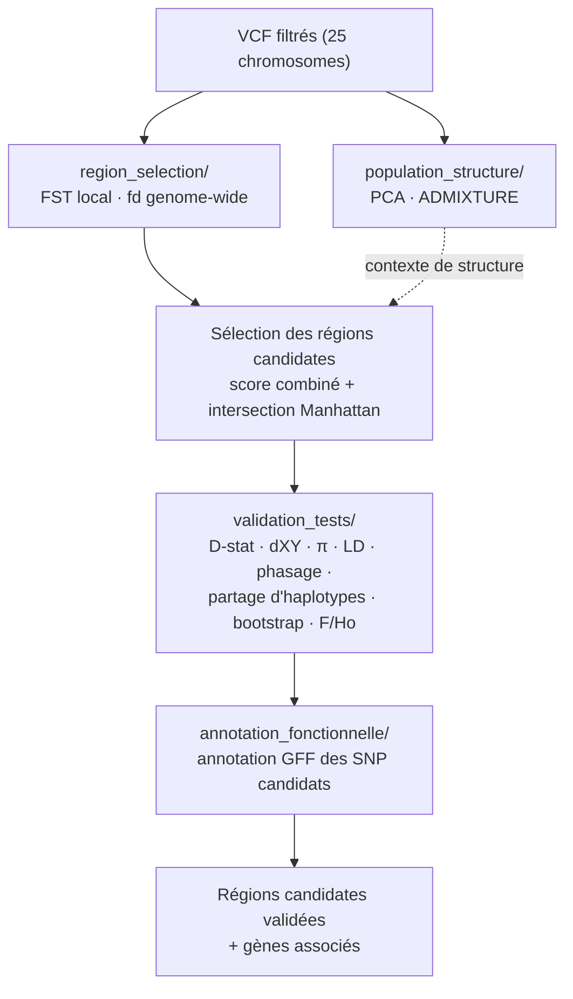

<p align="center">
  
  &nbsp;&nbsp;&nbsp;
  
</p>

<h1 align="center">Awassi Introgression Genomics</h1>

<p align="center">
  <a href="LICENSE"></a>
  
  
</p>

*Logos LECA (Laboratoire d'Écologie Alpine, UMR CNRS/UGA/USMB 5553) et CNRS (Centre National
de la Recherche Scientifique, tutelle du LECA) reproduits à titre d'affiliation ; propriété
de leurs institutions respectives, non couverts par la licence MIT de ce dépôt.*

## Contenu de ce dépôt

Ce dépôt contient 20 scripts, un par méthode utilisée dans le rapport, organisés selon les
mêmes sections que le rapport (structure de population, sélection des régions candidates,
tests de validation, annotation fonctionnelle).

Seule la version de référence de chaque méthode est publiée ici, sous un nom explicite : le
dépôt de travail complet (~340 scripts, itérations de mise au point incluses) reste local.

Chaque script commence par un commentaire d'en-tête (rôle, entrée, sortie, usage) et comporte
des commentaires dans le corps du code pour suivre chaque étape du calcul.

**Note** : les noms de fichiers ont été simplifiés par rapport au rapport de stage (qui cite
les noms internes du dépôt de travail dans son Annexe A). La table ci-dessous fait la
correspondance.

### Arborescence

```
awassi-introgression-genomics/
├── population_structure/       # PCA, ADMIXTURE
├── region_selection/            # FST, fd, sélection des régions candidates
├── validation_tests/            # D-stat, dXY, π, LD, phasage, partage d'haplotypes, F/Ho
├── annotation_fonctionnelle/    # annotation GFF des SNP candidats
├── _shared.py                   # fonctions communes (lecture VCF/metadata, pi) réutilisées
│                                 #   par plusieurs scripts de region_selection/ et validation_tests/
├── example_data/                # jeu de test synthétique (voir Données ci-dessous)
├── assets/                      # logos (README)
├── requirements.txt
└── LICENSE
```

`_shared.py` doit rester à la racine du dépôt (import résolu par chemin depuis chaque
script, indépendamment du répertoire courant).

### `population_structure/`

| Méthode | Script | Nom dans le rapport (Annexe A) |
|---|---|---|
| ACP (PLINK --pca 20) | `pca.sh` | `01_pca/01_run_pca_25chr_filtered.sh` |
| ADMIXTURE | `admixture.sh` | `admixture/03_run_admixture_K2_K8_v1.sh` |

### `region_selection/`

| Méthode | Script | Nom dans le rapport (Annexe A) |
|---|---|---|
| FST local 20 kb / pas 5 kb | `fst_local_genomewide.sh` | `fst/21_run_FST_local_20kb_step5kb_separate_EU_AM_AUS.sh` |
| FST par SNP | `fst_per_snp_fd_ld_plot.py` | `synthese/13b_plot_fst_fd_ld_aligned_v9_perSNPfst.py` |
| fd | `fd_genomewide.py` | `fd/02_fd_chr_all_awassi_pairs_20kb_step5kb.py` |
| Sélection — score combiné | `select_regions_score_combine.py` | `synthese/15_rebuild_v10b.py` |
| Sélection — intersection (Manhattan) | `select_regions_intersection_manhattan.py` | `synthese/23_manhattan_fst_fd_genomewide.py` |

### `validation_tests/`

| Méthode | Script | Nom dans le rapport (Annexe A) |
|---|---|---|
| D-stat 150 kb + jackknife | `dstat_blockjackknife.py` | `synthese/27_dstat_9regions_blockjackknife_v1.py` |
| dXY | `dxy.py` | `dxy/02_compute_dxy_local_candidates.py` |
| π avec contrôle qualité | `pi_regions_qc.py` | `synthese/30_pi_9regions_20kb_step5kb_QC_v1.py` |
| π — fond génomique | `pi_genomewide_baseline.py` | `synthese/50_pi_genomewide_baseline_v1.py` |
| Phasage (Beagle) | `phasing_beagle.sh` | `synthese/10_phase_5regions_beagle_v1.sh` |
| LD par sous-groupe | `ld_par_sousgroupe.py` | `synthese/35_ld_per_subgroup_9regions_v1.py` |
| Heatmap + arbre + LD | `heatmap_haplotypes_arbre_ld.py` | `synthese/26_heatmap_LD_arbre_9regions_v2.py` |
| Raréfaction (partage d'haplotypes) | `rarefaction_partage_haplotypes.py` | `synthese/34_rarefaction_haplotype_sharing_9regions_v1.py` |
| Partage d'haplotypes, tous groupes (dépendance) | `partage_haplotypes_tous_groupes.py` | `synthese/64_haplotype_sharing_all_groups_v1.py` |
| Bootstrap de spécificité | `bootstrap_specificite_haplotypique.py` | `synthese/65_haplotype_specificity_bootstrap_v1.py` |
| F et Ho | `heterozygotie_consanguinite.py` | `synthese/56_het_inbreeding_v1.py` |
| CCDC91 — reprise sur le cœur du pic | `ccdc91_retest_pic.py` | `synthese/69_ccdc91_peak_core_retest_v1.py` |

### `annotation_fonctionnelle/`

| Méthode | Script | Nom dans le rapport (Annexe A) |
|---|---|---|
| Annotation fonctionnelle (GFF Oar_v4.0) | `annotation_variants_gff.py` | `synthese/40_annotate_variants_9regions_v1.py` |

## Objectif de ce dépôt

Ce dépôt accompagne le rapport de stage *« Introgression génomique chez le mouton Awassi —
signaux locaux d'introgression et validation multi-critères »* (Tanguy Ruel,
[LECA](https://leca.osug.fr/)).

L'objectif est de rechercher **des régions du génome où la race Awassi (Moyen-Orient) présente
une affinité locale anormale avec un autre groupe géographique (Afrique, Asie, Europe) — un signal compatible avec une introgression**.

Les scripts de ce dépôt permettent de :

décrire la structure génétique des populations étudiées ;
parcourir l'ensemble du génome afin d'identifier des régions candidates à l'introgression ;
valider ces régions à l'aide de plusieurs méthodes complémentaires afin de distinguer les
véritables signaux du bruit statistique ;
identifier les gènes présents dans les régions candidates afin de proposer des hypothèses
sur leur intérêt biologique.

## Le mécanisme de l'introgression

### Qu'est-ce que l'introgression ?

L'introgression est la présence, dans le génome d'une population, d'un fragment d'ADN hérité
d'une autre population par métissage ancien.

Le signal recherché n'est pas la ressemblance globale entre races, car toutes les races
domestiques partagent une origine commune et se ressemblent donc naturellement sur l'ensemble
du génome. Le signal recherché est une ressemblance locale anormale : une région précise où
deux populations sont beaucoup plus proches que ne le laisserait prévoir leur parenté
générale, car cet écart trahit un échange génétique survenu après leur séparation (de
quelques générations à plusieurs millénaires).

La taille du fragment partagé indique aussi l'ancienneté de l'échange. Un long segment presque
identique signale une introgression récente, car les recombinaisons n'ont pas encore eu le
temps de le fragmenter. Un fragment court signale au contraire une introgression ancienne, car
il a été progressivement réduit par les recombinaisons et les mutations accumulées au fil des
générations.

### Comment apparaît une introgression, en général ?

Une introgression apparaît en trois étapes : un individu s'hybride avec un individu d'une
autre population, sa descendance se reproduit ensuite plusieurs générations avec la population
d'origine (rétrocroisements), puis la majeure partie du génome étranger disparaît au fil des
générations — sauf certains fragments, conservés durablement.

Un fragment se maintient surtout s'il apporte un avantage adaptatif (meilleure survie,
reproduction ou adaptation au milieu), car la sélection naturelle favorise alors sa diffusion
dans la population. C'est cette conservation durable d'un fragment d'ADN provenant d'une autre
population que l'on appelle une introgression.

## L'introgression chez le mouton Awassi

### 1. Origine du mouton

Tous les moutons domestiques (Ovis aries) descendent d'une unique espèce sauvage, le mouflon
d'Asie Mineure (Ovis gmelini, aussi appelé Ovis orientalis), car des études sur l'ADN
mitochondrial l'ont confirmé comme seul ancêtre maternel de l'ensemble des races domestiques.

La domestication a eu lieu il y a environ 10 000 ans au Proche-Orient (Anatolie, montagnes du
Zagros). Depuis ce foyer, les moutons se sont répandus sur plusieurs continents et ont évolué
indépendamment pendant des millénaires, donnant naissance aux centaines de races actuelles
d'Europe, d'Afrique, d'Asie et du Moyen-Orient — dont l'Awassi.

### 2. Pourquoi étudier l'Awassi ?

Ce stage étudie la race Awassi pour deux raisons.

La première est agronomique : l'Awassi est aujourd'hui la race laitière non européenne la plus
répandue au monde, car ce mouton à queue grasse — élevé du sud-est de la Turquie jusqu'à
l'Irak, la Syrie, la Jordanie et le Liban — est remarquablement adapté aux milieux arides (sa
queue stocke des réserves énergétiques mobilisables en période de sécheresse, sa toison de
type tapis limite l'échauffement dû au rayonnement solaire).

La seconde est historique : l'Awassi est un excellent modèle pour rechercher des échanges
génétiques anciens, car son aire d'élevage recouvre le berceau même de la domestication du
mouton — présente dans cette région depuis des millénaires, elle a côtoyé les nombreuses
populations ovines qui y ont circulé au fil de l'histoire.

### 3. Pourquoi rechercher l'introgression chez l'Awassi ?

L'Awassi est génétiquement très proche des autres races du Moyen-Orient — la différenciation
génétique entre elles n'est que d'environ 0,64 % à l'échelle du génome entier — car des
populations géographiquement proches ont davantage d'occasions d'échanger des individus au
cours du temps (transhumance, pâturages partagés, commerce, déplacements de troupeaux).

L'objectif est d'identifier les rares régions du génome où cette logique s'inverse, c'est-à-dire
les régions où l'Awassi ressemble davantage à une population d'Afrique, d'Asie ou d'Europe qu'à
ses voisins immédiats du Moyen-Orient. Un tel signal peut révéler un épisode ponctuel
d'introgression survenu au cours de l'histoire des populations, car les échanges commerciaux,
les migrations pastorales et la diffusion volontaire de races d'élevage ont déplacé des
animaux sur de longues distances au fil des siècles.

## Glossaire express

| Terme | Sens simple |
|---|---|
| SNP | Une position du génome où l'ADN diffère d'un individu à l'autre (une « lettre » variable). |
| VCF | Format de fichier qui liste les SNP observés chez tous les individus séquencés. |
| FST | Différenciation génétique entre deux groupes à un endroit du génome (0 = identiques, 1 = totalement différents). |
| fd / D-stat | Mesurent si un groupe partage anormalement plus d'ADN avec un autre groupe que prévu — signal d'introgression. |
| dXY | Divergence génétique brute entre deux groupes, indépendante de leur diversité interne. |
| π (pi) | Diversité génétique à l'intérieur d'un groupe. |
| LD (déséquilibre de liaison) | Tendance de deux positions du génome à être héritées ensemble ; un LD élevé et localisé peut trahir un bloc d'ADN introgressé récent. |
| PCA / ADMIXTURE | Méthodes qui résument la structure génétique globale d'un jeu d'individus (combien de groupes ancestraux, qui ressemble à qui). |
| Phasage | Reconstitution de quel allèle vient de quel chromosome parental, pour reconstruire des haplotypes. |
| Haplotype | Combinaison de variants portée ensemble sur un même chromosome. |
| Bootstrap / jackknife | Méthodes de ré-échantillonnage statistique pour estimer la fiabilité d'un résultat. |

## Déroulé du pipeline



## Logiciels externes utilisés (non fournis dans ce dépôt)

- [PLINK](https://www.cog-genomics.org/plink/) / [PLINK2](https://www.cog-genomics.org/plink/2.0/)
- [bcftools / vcftools](https://samtools.github.io/bcftools/)
- [ADMIXTURE](https://dalexander.github.io/admixture/) (Alexander et al. 2009)
- [Beagle 5.5](https://faculty.washington.edu/browning/beagle/beagle.html) (Browning et al. 2018)
- Python ≥ 3.8 : `pip install -r requirements.txt` (pandas, numpy, matplotlib, scipy) ; R (ggplot2)

## À savoir avant de relancer un script

- Tous les scripts supposent d'être lancés depuis la racine de ce dépôt.
- 5 scripts Python (`fd_genomewide.py`, `dxy.py`, `ccdc91_retest_pic.py`,
  `bootstrap_specificite_haplotypique.py`, `partage_haplotypes_tous_groupes.py`)
  prennent le dossier de données externe (`data/`, `analyses/`, hors dépôt) via
  `--project <dossier>`, sinon la variable d'environnement `AWASSI_PROJECT_DIR`, sinon
  le répertoire courant. Les autres scripts Python de `region_selection/` et
  `validation_tests/` gardent des chemins **relatifs** en dur en tête de fichier
  (`BASE`, `POP_DIR`, `VCF_DIR`, `OUTDIR`...) : pas de chemin absolu, mais à éditer
  directement dans le code si les données ne sont pas au même sous-chemin que celui
  utilisé pendant le stage.
- Les scripts shell (`pca.sh`, `admixture.sh`, `fst_local_genomewide.sh`,
  `phasing_beagle.sh`) suivent le même principe : dossier de données via
  `AWASSI_PROJECT_DIR` (sinon le répertoire courant), plus de chemin absolu en dur.
  `admixture.sh` prend en plus le binaire ADMIXTURE via `ADMIXTURE_BIN` (sinon cherché
  dans le `PATH`), `phasing_beagle.sh` le `.jar` de Beagle via `BEAGLE_JAR`.
- `pca.sh` s'appuie en plus sur un `config_project.sh` (variables `PROJECT_DIR`,
  `VCF_LIST`, `METADATA_VCF_ORDER`) et un script R (`scripts/01_pca/02_plot_pca_25chr.R`)
  du dépôt de travail interne, non inclus ici : script fourni à titre de référence de
  méthode, pas exécutable tel quel sans ces deux fichiers.
- `bootstrap_specificite_haplotypique.py` et `ccdc91_retest_pic.py` importent
  `partage_haplotypes_tous_groupes.py` par chemin de fichier : les trois doivent rester
  dans le même dossier `validation_tests/`.
- `ld_par_sousgroupe.py` importe directement `heatmap_haplotypes_arbre_ld.py`
  (même dossier requis).
- `fd_genomewide.py`, `dxy.py`, `pi_regions_qc.py`, `pi_genomewide_baseline.py`,
  `heterozygotie_consanguinite.py`, `heatmap_haplotypes_arbre_ld.py` et
  `dstat_blockjackknife.py` importent des fonctions communes depuis `_shared.py`
  (racine du dépôt) — voir Arborescence ci-dessus.

## Données

Les VCF bruts et les résultats intermédiaires volumineux ne sont pas inclus (taille, et
données génétiques dont la redistribution n'est pas garantie). Les tables de résultats
filtrées citées dans le rapport (régions candidates, métriques par test) sont disponibles sur demande.

### Jeu de test synthétique

[`example_data/`](example_data/) contient un petit jeu de données **entièrement synthétique**
(VCF + metadata, format identique aux données réelles) avec un signal d'introgression connu
et contrôlé, pour pouvoir essayer `fd_genomewide.py` et `dxy.py` sans les données du stage.
Voir [`example_data/README.md`](example_data/README.md) pour le détail du modèle de
simulation et les résultats obtenus.

## Remerciements

Merci à François, Océane (LECA) pour leur accompagnement pendant le
stage. Merci aussi à Frédéric Boyer pour nos échanges, ses idées
de méthode, et son aide sur heatmap + arbre + LD (`heatmap_haplotypes_arbre_ld.py`).

## Citation

Code disponible pour accompagner : Ruel T., *Introgression génomique chez le mouton
Awassi*, rapport de stage LECA, 2026.

## Licence

Code sous licence MIT (voir `LICENSE`). Les données génomiques associées ne sont pas
couvertes par cette licence.
